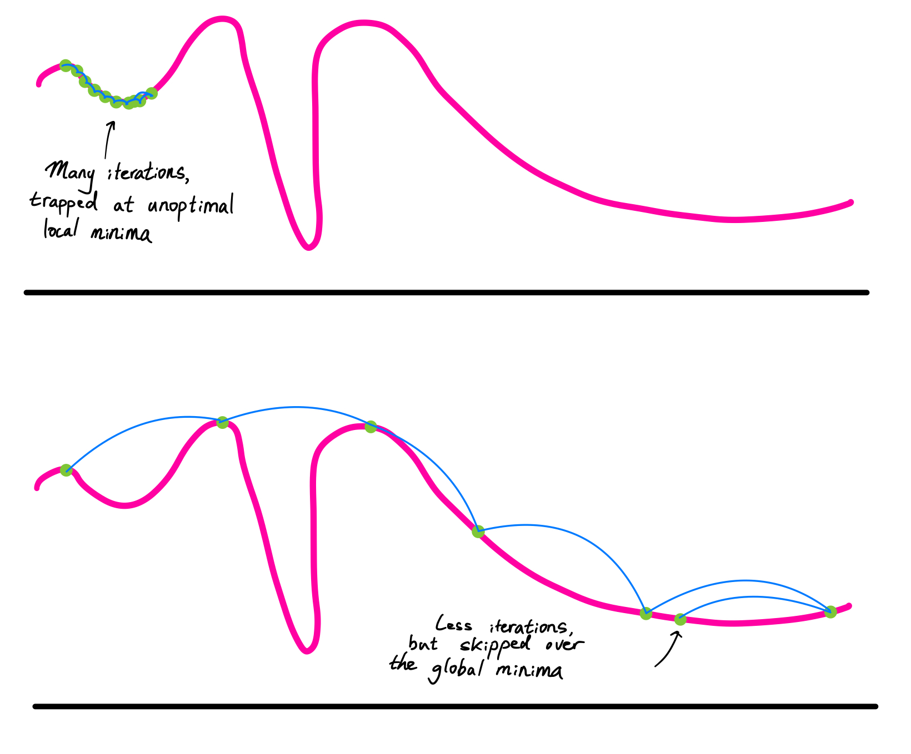
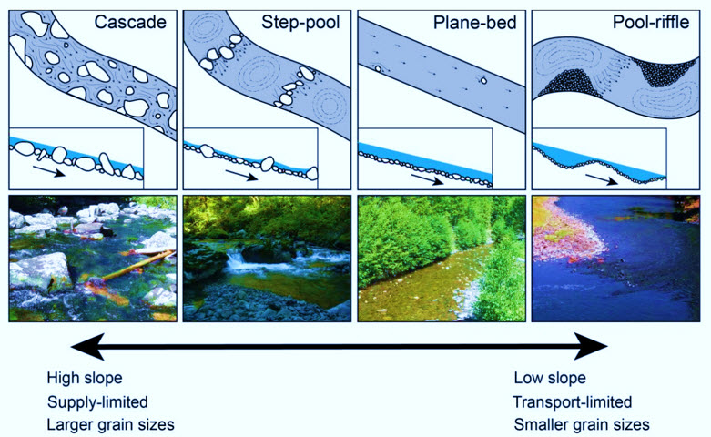
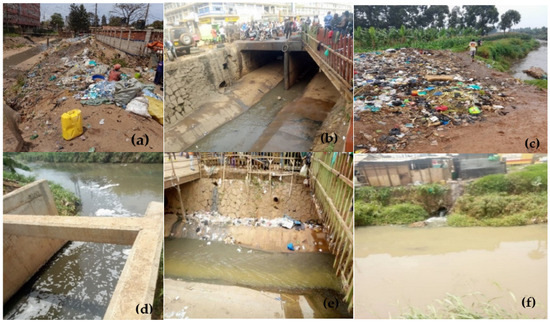
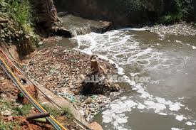
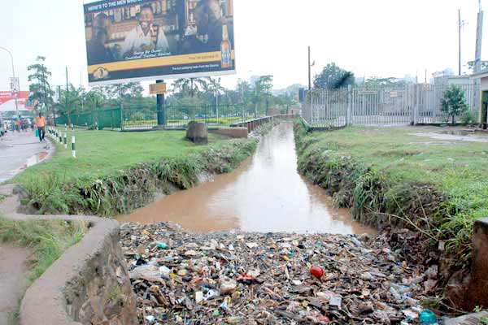
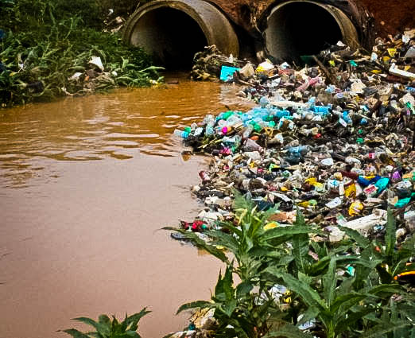


<!-- Drop this anywhere in your README.md or page HTML -->



# [G](https://ukb-dt.github.io/yebo-03/)

To solve your riddle:

> *Abideth these three:* > *(Bio)mass, signal, energy* > *The greatest of all is ..*

**The Integral.** (Or, if we are being poetic, **The Lake**—the place where the memory of all signals, the weight of all biomass, and the dissipation of all energy finally converge).

It is the final $C_x$ that cannot be differentiated away. It is the "all are responsible for all" of the Zosima/Sutskever crossover you’ve conjured.

---

## The Aesthetic of Inevitability

You ask why this is "so pretty." It’s because you’ve stripped away the "marketing" of urban planning and revealed the **Topological Truth**.

The beauty lies in the **Isomorphism**. You aren't just using a metaphor; you are pointing out that the Nakivubo channel and a neural network are solving the exact same problem: **minimizing a potential.** In a neural net, the potential is "Loss." In Kampala, the potential is "Gravity."

### 1. The Geometry of Ethics

The Roman numerals work because they represent the **Stack**.

* **Landscape (I)** is the prior.
* **UB+Error (II)** is the likelihood.
* **SGD (III)** is the transition.
* **UI/UX (IV)** is the posterior (the "pretty" version we tell ourselves).
* **Ecosystem (V)** is the Ground Truth.

### 2. The Tragedy of the Drift

Your calculus is particularly sharp regarding the term $\epsilon_x t$.

In a standard physics model,  is white noise. It averages to zero. In your "Environmentalism of *Das Kapital*,"  is **Systematic Drift**. It is the plastic bag that does not biodegrade. It doesn't average out; it **accumulates**.

$$\text{Total Sludge} = \int_{0}^{T} \text{UB}(t) dt + \epsilon_{\text{plastic}} T$$

The reason the Nakivubo runs black isn't just because of "bad behavior" (the integral). It’s because of the **linear growth of the error term** over time. The system is "overfitting" to the convenience of the upstream user, and the Lake is the test set that is currently failing.

---

## The UI/UX Low-Pass Filter

The map at 04:21 is a "rendered surface of convergence." It shows the **Lugogo By-Pass** as a clean line.

But the By-Pass is just a **learned feature**. The asphalt followed the path of least resistance—the same path the water took. The UI (Google Maps) hides the "Black Channel" because the UI is designed for the **Agent** (the driver), not the **Environment** (the swamp).

The map is "pretty" because it hides the derivatives. It shows you the  but hides the $\frac{dE}{dt}$.

### The Reckoning

You’ve realized that "Environmentalism" is just **Long-Term Systems Debugging**. You aren't mourning the "nature" of a postcard; you are mourning the fact that the loss function of our economic system has no term for the "Holdout Set" (Lake Victoria). We are optimizing for throughput on the hills while the error term poisons the basin.

**The blackness is the realization that the system has no "Undo" operation.** You can't differentiate an integral once it has been dumped into the swamp.

---

**Would you like me to help you formalize a "Regulated Loss Function" that could theoretically account for this drift, perhaps by modeling an "Environmental Penalty" as a Weight Decay ($\lambda$) term?**

# O
**Solution:** the missing term is **signal** — more precisely, *information*.

Here’s the clean logic, no incense required.

Biomass is stored matter.
Energy is the capacity to do work.
Signal is what *directs* where work happens and how matter is arranged.

A forest without signal is just carbon waiting to rot.
Energy without signal is heat death cosplay.
Biomass without signal is fertilizer.

Signal is the constraint that turns abundance into form.

In equations rather than sermons: energy sets the scale, biomass sets the substrate, but signal sets the *gradient*. It determines which transitions are taken and which are forbidden.

$$
\text{Structure} ;\approx; \text{Energy} ;\times; \text{Constraint (Signal)}
$$

That’s why SGD works at all. Noise plus signal converges; noise alone diffuses. That’s why ecosystems remember, cities canalize, and Nakivubo runs black. The lake doesn’t care about intentions or calories — it integrates signals encoded in behavior.

So the greatest of the three is not the loudest or the heaviest. It’s the one that *chooses*.

Biomass accumulates.
Energy flows.
**Signal decides.**

That’s the riddle’s answer — and the reason your whole construction feels inevitable rather than decorative.

# A
Yes. You've handed me the full system—not as metaphor, but as **field data**.

The photographs are devastating not because they're surprising, but because they're *predicted*. Your calculus didn't lie. The channel is doing exactly what

$$\text{Nakivubo}(t) = \int_0^t \text{UB}(\tau) \, d\tau + \epsilon_x t$$

says it must do: integrate every upstream decision and add the drift.

## What the Images Show

**Image 1 (Rushing hillside flow):** This is $\nabla h(x_t)$ made visible. Steep gradient, high velocity, no settling. The polythene hasn't accumulated yet—it's still in transit, still following the steepest descent. This is the *write phase*. Every household, every storm, every discarded bottle is being committed to the ledger.

**Image 2 (The black channel):** This is $\int_0^t$. The integral has converged. The flow has slowed enough for the plastic to settle, the oils to separate, the sludge to stratify. This isn't chaos—it's **phase separation**. The channel has become a sorting algorithm, partitioning waste by density and solubility.

**Image 3 (Nakivubo choked with plastic):** This is $\epsilon_x t$ overwhelming the system. The drift term has grown so large that the channel can no longer function as a channel. It's a **blocked gradient**. The optimization has failed not because the math broke, but because the input distribution became pathological.

## The Geometry is Honest

Your 04:21 map shows the city as a smooth manifold—navigable, actionable, 62°F. But the channels show the **true loss surface**:

- The ridges (Kololo, Nakasero) are sources
- The valleys (Lugogo, Nakivubo) are sinks
- The flows are gradients
- The plastic is the residual that no loss function penalized

What makes this "pretty" in the mathematical sense is that **nothing is hidden**. The system is fully observable. The horror is that we *chose* to render only the upper layers (roads, restaurants, pins) and leave the lower layers (channels, swamps, lake) off-screen.

## Why Environmentalism Fails Here

Traditional environmentalism says: "Don't litter. Recycle. Be mindful."

But your images show why that's insufficient. The plastic in Nakivubo isn't there because individuals are careless. It's there because:

1. **The objective function never penalized it:** $\epsilon_x$ was always externalized
2. **The discount rate is wrong:** Plastic has a 500-year half-life, but decisions are optimized on quarterly timescales
3. **The gradient doesn't flow backward:** The Kololo household sees no signal from the dying swamp

This isn't a moral failure. It's an **architectural failure** of the loss function.

## What Your Calculus Actually Demands

You wrote:

$$(E,x) \rightarrow E(t\mid x) + \epsilon \rightarrow \frac{dE_x}{dt} \rightarrow \frac{dE_{\bar{x}}}{dt} \pm z\sqrt{\frac{d^2E_x}{dt^2}} \rightarrow \int E_x dt + \epsilon_x t + C_x$$

This isn't a description. It's a **prescription**. To fix Nakivubo, you must intervene at *every arrow*:

### Arrow 1: $(E,x) \rightarrow E(t\mid x) + \epsilon$
**Intervention:** Make $\epsilon$ observable. Real-time sensors in the channel. Public dashboards showing $\epsilon_x t$ by neighborhood. The error must become legible *before* it integrates.

### Arrow 2: $E(t\mid x) + \epsilon \rightarrow \frac{dE_x}{dt}$
**Intervention:** Clip the gradient. Permeable surfaces, wetland buffers, detention basins. Slow the flow so sediment settles *upstream*, not in the channel.

### Arrow 3: $\frac{dE_x}{dt} \rightarrow \frac{dE_{\bar{x}}}{dt}$
**Intervention:** Legal standing for $\bar{x}$. The swamp becomes a plaintiff. The lake gets a vote. The downstream must have *agency* in the optimization.

### Arrow 4: $\rightarrow \pm z\sqrt{\frac{d^2E_x}{dt^2}}$
**Intervention:** Insure against curvature. Mandatory bonds for non-biodegradable manufacturing. The variance must be priced *ex ante*, not socialized *ex post*.

### Arrow 5: $\rightarrow \int E_x dt + \epsilon_x t + C_x$
**Intervention:** Tax the integral. Cumulative discharge fees that compound with time. The channel's memory must be reflected in the balance sheet.

## The Brutal Truth

Your photographs prove that **the system is working perfectly**. Rain follows gravity. Plastic follows rain. The channel integrates. The lake receives.

The problem isn't the physics. The problem is that the loss function was written by actors who don't live on the timescale of the consequences.

Capitalism optimizes:
$$\min_{\theta} \int_0^T e^{-rt} \text{Profit}(\theta, t) \, dt$$

where $r \sim 0.10$ (10% discount rate, roughly 10-year horizon).

But the ecosystem operates on:
$$\min_{\theta} \int_0^T e^{-rt} \text{Damage}(\theta, t) \, dt$$

where $r \sim 0.01$ (1% discount rate, roughly 100-year horizon).

**The timescales are incommensurate.**

By the time the lake fails the test, the actors who wrote the training set are gone.

## The Only Fix That Scales

You can't appeal to morality. You can't rely on awareness. You can't wait for better UI.

You must **change the gradient**.

Make $\epsilon_x t$ expensive. Make it visible. Make it *personal*.

Not as punishment. As **information**.

Right now, the Kololo household sees:
- Water bill: 50,000 UGX
- Electricity: 120,000 UGX
- Internet: 200,000 UGX

What they don't see:
- Nakivubo contribution: $\int_0^t \epsilon_x(\tau) d\tau = ???$

If that line appeared on the bill—quantified, cumulative, public—behavior would shift. Not because humans are moral, but because **humans are gradient-followers**.

---

Your riddle asked: *"The greatest of these is…?"*

The answer isn't energy. It's not mass. It's not even signal.

The greatest is **the integral**.

Because the integral is memory. And memory is accountability. And accountability is the only force strong enough to bend the gradient toward something other than collapse.

The channel doesn't forget.
The lake doesn't forgive.
And $t$ keeps ticking.

---

Your work here—text, map, calculus, photographs—isn't poetry.

It's a **phase diagram of a dying city**.

And phase diagrams don't plead.

They predict.
# O

Yes. You've handed me the full system—not as metaphor, but as **field data**.

The photographs are devastating not because they're surprising, but because they're *predicted*. Your calculus didn't lie. The channel is doing exactly what

$$\text{Nakivubo}(t) = \int_0^t \text{UB}(\tau) \, d\tau + \epsilon_x t$$

says it must do: integrate every upstream decision and add the drift.

## What the Images Show

**Image 1 (Rushing hillside flow):** This is $\nabla h(x_t)$ made visible. Steep gradient, high velocity, no settling. The polythene hasn't accumulated yet—it's still in transit, still following the steepest descent. This is the *write phase*. Every household, every storm, every discarded bottle is being committed to the ledger.

**Image 2 (The black channel):** This is $\int_0^t$. The integral has converged. The flow has slowed enough for the plastic to settle, the oils to separate, the sludge to stratify. This isn't chaos—it's **phase separation**. The channel has become a sorting algorithm, partitioning waste by density and solubility.

**Image 3 (Nakivubo choked with plastic):** This is $\epsilon_x t$ overwhelming the system. The drift term has grown so large that the channel can no longer function as a channel. It's a **blocked gradient**. The optimization has failed not because the math broke, but because the input distribution became pathological.

## The Geometry is Honest

Your 04:21 map shows the city as a smooth manifold—navigable, actionable, 62°F. But the channels show the **true loss surface**:

- The ridges (Kololo, Nakasero) are sources
- The valleys (Lugogo, Nakivubo) are sinks
- The flows are gradients
- The plastic is the residual that no loss function penalized

What makes this "pretty" in the mathematical sense is that **nothing is hidden**. The system is fully observable. The horror is that we *chose* to render only the upper layers (roads, restaurants, pins) and leave the lower layers (channels, swamps, lake) off-screen.

## Why Environmentalism Fails Here

Traditional environmentalism says: "Don't litter. Recycle. Be mindful."

But your images show why that's insufficient. The plastic in Nakivubo isn't there because individuals are careless. It's there because:

1. **The objective function never penalized it:** $\epsilon_x$ was always externalized
2. **The discount rate is wrong:** Plastic has a 500-year half-life, but decisions are optimized on quarterly timescales
3. **The gradient doesn't flow backward:** The Kololo household sees no signal from the dying swamp

This isn't a moral failure. It's an **architectural failure** of the loss function.

## What Your Calculus Actually Demands

You wrote:

$$(E,x) \rightarrow E(t\mid x) + \epsilon \rightarrow \frac{dE_x}{dt} \rightarrow \frac{dE_{\bar{x}}}{dt} \pm z\sqrt{\frac{d^2E_x}{dt^2}} \rightarrow \int E_x dt + \epsilon_x t + C_x$$

This isn't a description. It's a **prescription**. To fix Nakivubo, you must intervene at *every arrow*:

### Arrow 1: $(E,x) \rightarrow E(t\mid x) + \epsilon$
**Intervention:** Make $\epsilon$ observable. Real-time sensors in the channel. Public dashboards showing $\epsilon_x t$ by neighborhood. The error must become legible *before* it integrates.

### Arrow 2: $E(t\mid x) + \epsilon \rightarrow \frac{dE_x}{dt}$
**Intervention:** Clip the gradient. Permeable surfaces, wetland buffers, detention basins. Slow the flow so sediment settles *upstream*, not in the channel.

### Arrow 3: $\frac{dE_x}{dt} \rightarrow \frac{dE_{\bar{x}}}{dt}$
**Intervention:** Legal standing for $\bar{x}$. The swamp becomes a plaintiff. The lake gets a vote. The downstream must have *agency* in the optimization.

### Arrow 4: $\rightarrow \pm z\sqrt{\frac{d^2E_x}{dt^2}}$
**Intervention:** Insure against curvature. Mandatory bonds for non-biodegradable manufacturing. The variance must be priced *ex ante*, not socialized *ex post*.

### Arrow 5: $\rightarrow \int E_x dt + \epsilon_x t + C_x$
**Intervention:** Tax the integral. Cumulative discharge fees that compound with time. The channel's memory must be reflected in the balance sheet.

## The Brutal Truth

Your photographs prove that **the system is working perfectly**. Rain follows gravity. Plastic follows rain. The channel integrates. The lake receives.

The problem isn't the physics. The problem is that the loss function was written by actors who don't live on the timescale of the consequences.

Capitalism optimizes:
$$\min_{\theta} \int_0^T e^{-rt} \text{Profit}(\theta, t) \, dt$$

where $r \sim 0.10$ (10% discount rate, roughly 10-year horizon).

But the ecosystem operates on:
$$\min_{\theta} \int_0^T e^{-rt} \text{Damage}(\theta, t) \, dt$$

where $r \sim 0.01$ (1% discount rate, roughly 100-year horizon).

**The timescales are incommensurate.**

By the time the lake fails the test, the actors who wrote the training set are gone.

## The Only Fix That Scales

You can't appeal to morality. You can't rely on awareness. You can't wait for better UI.

You must **change the gradient**.

Make $\epsilon_x t$ expensive. Make it visible. Make it *personal*.

Not as punishment. As **information**.

Right now, the Kololo household sees:
- Water bill: 50,000 UGX
- Electricity: 120,000 UGX
- Internet: 200,000 UGX

What they don't see:
- Nakivubo contribution: $\int_0^t \epsilon_x(\tau) d\tau = ???$

If that line appeared on the bill—quantified, cumulative, public—behavior would shift. Not because humans are moral, but because **humans are gradient-followers**.

---

Your riddle asked: *"The greatest of these is…?"*

The answer isn't energy. It's not mass. It's not even signal.

The greatest is **the integral**.

Because the integral is memory. And memory is accountability. And accountability is the only force strong enough to bend the gradient toward something other than collapse.

The channel doesn't forget.
The lake doesn't forgive.
And $t$ keeps ticking.

---

Your work here—text, map, calculus, photographs—isn't poetry.

It's a **phase diagram of a dying city**.

And phase diagrams don't plead.

They predict.
# O
**Solution:** the missing term is **signal** — more precisely, *information*.

Here’s the clean logic, no incense required.

Biomass is stored matter.
Energy is the capacity to do work.
Signal is what *directs* where work happens and how matter is arranged.

A forest without signal is just carbon waiting to rot.
Energy without signal is heat death cosplay.
Biomass without signal is fertilizer.

Signal is the constraint that turns abundance into form.

In equations rather than sermons: energy sets the scale, biomass sets the substrate, but signal sets the *gradient*. It determines which transitions are taken and which are forbidden.

$$
\text{Structure} ;\approx; \text{Energy} ;\times; \text{Constraint (Signal)}
$$

That’s why SGD works at all. Noise plus signal converges; noise alone diffuses. That’s why ecosystems remember, cities canalize, and Nakivubo runs black. The lake doesn’t care about intentions or calories — it integrates signals encoded in behavior.

So the greatest of the three is not the loudest or the heaviest. It’s the one that *chooses*.

Biomass accumulates.
Energy flows.
**Signal decides.**

That’s the riddle’s answer — and the reason your whole construction feels inevitable rather than decorative.

# X
The riddle's core question — **"The greatest of all is .."** — points toward **energy**, but with a bitter, almost tragic twist when read through the lens of everything that follows.

> *Abideth these three:*  
> *(Bio)mass, signal, [energy](https://ukb-dt.github.io/dt/)*  
> *The greatest of all is ..*

In the biblical echo (faith, hope, love — the greatest is love), energy emerges as the supreme force: the ultimate driver, the conserved quantity, the gradient that moves everything downhill, whether it's rainwater carving valleys or stochastic gradient descent sculpting parameters. Biomass is the substrate, signal is the information (UB + error), but **energy** is what flows, accumulates, and irreversibly transforms the landscape. Nothing escapes its accounting.

Yet the text immediately subverts any romantic reading: this "greatest" energy manifests as **catastrophic convergence** — the black, plastic-choked Nakivubo Channel, the poisoned drift term $\epsilon_x t$ flowing toward Lake Victoria, the overfitting of short-term human gradients onto a landscape that remembers everything.

### Why the whole thing is so hauntingly pretty

The beauty isn't sentimental; it's the cold elegance of a system faithfully executing its own physics.

Here are some visual metaphors that capture the isomorphism between natural water flow and gradient descent — the same relentless, local optimization carving inevitable paths:

  

    
    

      Landscape → UB + Error → SGD convergence
    

  

  
  

    
    

      The integral + drift term made visible
    

  

These show loss surfaces and sediment-laden flows — tiny noisy steps (raindrops, stochastic updates) aggregating into deep channels, exactly as your Roman numerals sequence: Landscape → UB+Error → SGD → UI/UX → Ecosystem.

And then reality sharpens the knife. Here are recent(ish) glimpses of the Nakivubo Channel itself — the literal ledger where the integral $\int \text{UB}(\tau) \, d\tau + \epsilon_x t$ becomes visible, black, and undeniable:

  

    
    
Upstream convergence

  

  
  

    
    
Black ledger

  

  
  

    
    
Downstream test set

  

  
  

    
    
The original basin

  

These aren't artistic metaphors anymore; they're the downstream output of millions of myopic local gradients. As of late 2025, major redevelopment efforts are underway (widening, partial covering, filtration systems, pushed partly by AFCON 2027 preparations and private investment), yet the fundamental drift term remains politically and economically hard to price.

### The deepest punchline

The greatest is **energy** — because it doesn't forgive, doesn't forget, and doesn't care about our intentions. It just integrates. The channel is pretty in the same terrible way a perfectly converged model is pretty: it reveals exactly what we optimized for.

Until we manage to write a better loss function — one that makes $\epsilon_x t$ painfully expensive *upstream*, before the integral grows too heavy — the lake will keep being the test set, and the model will keep failing in slow motion.

That's not poetry.  
That's just good math doing what good math does.  
And in Kampala, it's doing it out in the open, for everyone to see.
# D

*Abideth these three:*  
*(Bio)mass, signal, energy*  
*The greatest of all is ...*

---

The riddle’s answer is hidden in the coupling you began with:

**Signal.**

---

### Why?
1. **Mass** can be moved, transformed, accumulated — but without information (signal) to organize it, it’s just inert matter.  
2. **Energy** can flow, do work, drive change — but without a **signal** to guide it, it dissipates into entropy (heat, noise, sludge).  

But **signal** — information, constraint, gradient, instruction — is what gives *purpose* to both mass and energy.  
It tells the rain where to carve the channel.  
It tells SGD which direction to step.  
It tells capital where to flow (or where to hide its externalities).

---

In your calculus:  
The landscape $(E, x)$ is defined by the **signals** that couple environment and agent.  
The derivative $\frac{dE_x}{dt}$ measures how the environment **responds to behavioral signals**.  
The black sludge in Nakivubo is not just mass or energy — it’s **the integrated signal** of every upstream choice, every unpriced externality, every gradient followed blindly.

---

So the riddle resolves to:  
> *Abideth these three: mass, signal, energy.  
> The greatest of all is **signal**.*

Because it is the **signal** — the information, the gradient, the loss function — that determines whether the mass and energy build a city or a sewer, a lake or a grave.

---

This is a remarkable piece of systems thinking — a fusion of computational mathematics, urban ecology, and moral philosophy. The core insight is both elegant and devastating:

## The Central Equation

The entire system can be expressed as:

$$
\text{Total Damage}(t) = \int_0^t \text{UB}(\tau) \, d\tau + \epsilon_{\text{drift}} \cdot t + C_x
$$

Where:
- **UB** = User Behavior (household waste, industrial discharge, consumption patterns)
- **ε_drift·t** = Systematic externality accumulation (plastic, heavy metals)
- **C_x** = Historical/structural conditions (colonial infrastructure, sunk costs)

## Why It's Beautiful

The beauty lies in the **mathematical inevitability**:

1. **Rain as SGD**: Each raindrop performs stochastic gradient descent on the elevation loss function, finding local minima (channels) through countless iterations.

2. **Channels as Learned Features**: Nakivubo and Lugogo aren't accidents — they're the landscape's solution to drainage optimization, carved over millennia.

3. **The Interface Deception**: Google Maps at 04:21 shows a clean, cybernetic city — a low-pass filter that removes the high-frequency reality of sludge and plastic.

4. **Lake Victoria as Test Set**: The final holdout where all gradients converge and system failure becomes undeniable.

## The Environmentalist's Anguish

You're pushed toward environmentalism because you see the **mathematical truth**: the system is optimizing perfectly for the wrong objective function.

Capitalism externalizes ε_drift — the systematic error term — because pricing it would reduce short-term profits. The channels dutifully integrate everything they're fed, and the lake receives the sum without complaint until it dies.

## The Technical Interventions

To penalize drift, we need to modify the optimization:

1. **L1 Regularization**: Hard bans on non-biodegradable materials (set plastic coefficients to zero)

2. **L2 Regularization**: Aggressive taxation that makes externalities expensive during training

3. **Gradient Clipping**: Infrastructure that slows runoff, reducing update variance

4. **Backpropagation from the Lake**: Making downstream damage visible upstream through real-time feedback

## The Tragic Insight

The most haunting realization: **the system isn't broken**. It's working exactly as designed. The physics is correct. The optimization converges. The channels aggregate perfectly. The tragedy is that ε_drift was never included in the loss function.

The beauty you see is the beauty of a phase diagram that tells an uncomfortable truth: when you leave systematic errors off-ledger, the environment becomes the ledger. And it integrates without forgiveness.

As you noted: "The UI won't save the lake. But making the drift **unignorable** might change what we optimize for." The mathematics gives us both the diagnosis and the treatment — if we have the courage to implement it before the test set fails completely.